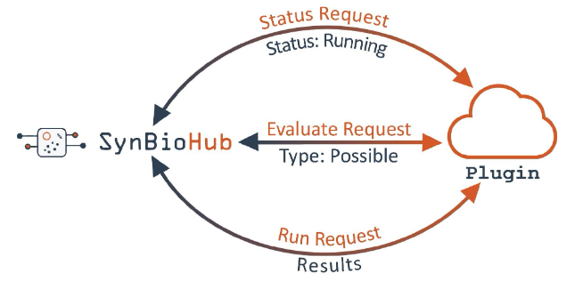

# Plugins

## 1. What are Plugins?
Plugins are modular stand-alone additions to SynBioHub. They function in a way that is similar to browser extensions. They can be installed separately from the browser/SynBioHub and provide additional 'custom' functionality to the browser/SynBioHub experience despite having a completely separate code base from the browser/SynBioHub. Though, they seem integrated to the user.

### 1.1 Types of Plugins
Currently there are three types of plugins available: 
1. Submit: Submit plugins are available to use from the [submit endpoint](https://synbiohub.github.io/api-docs/?python#submission-endpoints). They work by taking in the file that is uploaded in the submit and processing it to return SBOL to the SynBioHub endpoint.

2. Rendering: Rendering plugins are available on all 'endpoint' pages, for example pages for components, sequences, activities, etc. Rendering plugins return html to be displayed on the page.

3. Download: Download plugins are available on all 'endpoint' pages, for example pages for components, sequences, activities, etc. Download plugins return some kind of file which is downloaded by the user.

## 2. How Do Plugins Work?

### 2.1 Overview
* All plugins in actual sense are servers (i.e, a piece of software in a network that is used to provide services such as access to files or the routing of an e-mail to other pieces of software or hardware (clients) in the network). 

* All plugins have at least 3 endpoints: *status*, *evaluate*, and *run*. SynBioHub sends a status request to the status endpoint, if the response is that the plugin is up and running, SynBioHub then sends an evaluate request. The evaluate request tests whether the plugin can handle the data that SynBioHub wishes to send. If the plugin responds positively, SynBioHub then sends data to the run endpoint and uses the final results in the appropriate manner for the plugin type. 

* Note that plugins are asynchronous meaning that the full SynBioHub page can load without having to wait for the plugin to have returned the  results. Subsequently, when the results are returned SynBioHub substitutes the received information for the placeholder it had used when loading the page initially.

### 2.2 Installation
As the plugins are standalone servers & they don't have to be used in conjunction with SynBioHub. Though plugins have been developed to interface directly with SynBioHub, it is possible to install them and then interact with them via the API (from the command line or via a GUI interface such as [Postman](https://www.postman.com/)). Different methods of installation are discussed below. For those who're less-experienced with Programming, it is suggested that you should be using plugins with SynBioHub.

#### 2.2.1 Using SynBioHub
 
A detailed explaination on how to install SynBioHub on various operating systems is written [here](https://synbiohub.github.io/installation/)
A full list of plugin file names and their descriptions can be found [here](https://synbiohub.github.io/synbiohub-docker/#plugins).

##### 2.2.1.1 Common Problems

The most common problems that you may face while executing the commands mentioned above are as follows:-

1. The plugins might try to use ports that are already in use. If upon running the above commands and then using `docker ps` not all of the   'images' that you expect are present then try the following command: `docker ps –a`. 
  If you now see the image(s) you were missing with the status 'created' it suggests that they have a port clash. If this is the case you can go in the docker-compose file for the appropriate plugin and change the port number (the first four digit number under “ports”). Then try running step 4 of the above commands again.

2. If you've locally installed SynBioHub using the above commands it might cause issues in some plugins, that will receive urls that look like: ``http://localhost:7777/xxxxxxx``. Localhost in docker containers refers to the container itself. The problem is explained further [here](https://medium.com/it-dead-inside/docker-containers-and-localhost-cannot-assign-requested-address-6ac7bc0d042b). On Linux this problem is solvable and the solution cab be found on [stack overflow](https://stackoverflow.com/questions/31324981/how-to-access-host-port-from-docker-container) and on [docker](https://docs.docker.com/network/host/).

##### 2.2.1.2 Adding Plugins to the Admin Panel

After getting the plugins up and running you still have to add them to the admin panel in SynBioHub. Navigate to the plugin section of the admin panel. Choose the appropriate section i.e, rendering, submit, or download and give the plugin a descriptive name. Then in the url section there are several different options depending on exactly how the plugin was brought up:

* If plugins were brought up using docker compose:
Use `http://localhost:<port>/` e.g. `http://localhost:8093/` for the Excel Submit Library plugin Or use the following alternative: `http://<docker container name>:5000/` e.g. `http://synbiohub-docker_pluginSubmitExcelLibrary_1:5000/` for the Excel Submit Library plugin.

* Another alternative that is not recommended but still can be used is to enter `http://<synbiohub docker network ip address>:<port> /` e.g. `http://172.18.0.1:8093/` for the Excel Submit Library plugin when the synbiohub-docker network is "172.18.0.1".

* Find out the synbiohub-docker network ip by typing into the terminal the following command `docker inspect synbiohub-docker_default` and the address following 'Gateway' is the ip address you want. Note that this will change every time you run the docker compose command.

* If in the case that plugins are hosted elsewhere on a public server then simply use the url to access them e.g.: https://seqviz.synbiohub.org/ for the seqviz plugin (this method is also possible if you have named and exposed internal ports from your docker compose (this requires [caddy](https://caddyserver.com/)).

#### 2.2.2 Using a Standalone Docker Container
If you just want to bring up the plugin as a stand-alone Docker container you can simply pull the image from docker hub. 

* First make sure you have docker-desktop installed for your OS. Then it should be open and running with admininstrative permissions. 

* Then in the terminal run the following command `docker run --publish <publish port>:5000 --detach --name <nickname of your choice> synbiohub/<docker image name>`.

e.g: `docker run --publish 8093:5000 --detach --name submit-plug synbiohub/plugin-submit-excel-library:snapshot` for the excel library submit plugin.
It is suggested that the same publish ports are used when using docker compose. The list of those ports can be found [here](https://synbiohub.github.io/synbiohub-docker/#plugins).

##### 2.2.2.1 Common Problems
The most common problems that you may face while executing the commands mentioned above are as follows:-

1. Localhost:-  If the plugin is being run as a docker container that localhost may cause problems as localhost is considered within the container and won't point to the localhost on your computer. The problem is explained further [here](https://medium.com/it-dead-inside/docker-containers-and-localhost-cannot-assign-requested-address-6ac7bc0d042b). On Linux this problem is solvable and solution can be found on [stack-overflow](https://stackoverflow.com/questions/31324981/how-to-access-host-port-from-docker-container and https://docs.docker.com/network/host/).

#### 2.2.3 Using Standalone Methods

Plugins can also be run without using docker. How this is done depends on the programming language and packages used to create the server. We've provided the documentation for two of the most common server choices, i.e python using flask and javascript using express.

##### 2.2.3.1 Python Flask Servers
**NOTE**: You might have to add pandas to the requirements if you are running the plugins as standalone (this is not needed if you are running the plugin via docker since, we use a base image which contains pandas pre-installed as it is extremely difficult and highly buggy to install via docker on a python base image).

###### 2.2.3.1.1 For Anaconda

1. Open the terminal
2. Clone the repository for the plugin (For example:-  `git clone https://github.com/SynBioHub/Plugin-Submit-Excel-Library.git`)
3. Change directory into the repository folder using the command ` cd <repo-name>`(For repo-name enter your local repository name).
Now, open the anaconda prompt and carry out the rest of the commands in the anaconda prompt.
4. Enter the following commmand: `conda install --file requirements.txt`.
5. Then, enter the following command: `set FLASK_APP=app.py`
6. **OPTIONAL command**:  `set FLASK_ENV=development`
7. Finally, enter `flask run --port 5000` (the -- port 5000 is optional instead of 5000 there any port numbercan be entered)
8. The server should then be accessible at `http://localhost:5000/status`. Hence, open your browser an the enter `http://localhost:5000/status`.

###### 2.2.3.1.2 For Python

###### 2.2.3.1.2.1 Mac OS/Linux
1. Open the terminal.
2. Clone the repository using the command `git clone <Repo-Link>` (For Example:`git clone https://github.com/SynBioHub/Plugin-Submit-ExcelLibrary.git`)
3. Change directory into the repository folder using the command ` cd <repo-name>`(For repo-name enter your local repository name).
4. Enter the following command: `pip install -r requirements.txt`
5. Then, enter the following command: `export FLASK_APP=app`
6. Finally to start flask, enter the following command: `flask run`
7. The server should then be accessible at `http://localhost:5000/status`. Hence open your browser and enter `http://localhost:5000/status`

###### 2.2.3.1.2.2 Windows OS
1. Open the terminal
2. Clone the repository using `git clone <Repo-link>` (For Example `git clone https://github.com/SynBioHub/Plugin-Submit-Excel-Library.git`)
3. Change directory into the repository folder using the command ` cd <repo-name>`(For repo-name enter your local repository name).
4. Enter the following command: `pip install -r requirements.txt`
5. In the **Powershell**, enter the follwing command: `$env:FLASK_APP = "app"` or in the **command window**: `set FLASK_APP=app`

6. Finally to run flask, enter the following commmand: `flask run`
7. The server should then be accessible at `http://localhost:5000/status`. Hence open your browser and enter `http://localhost:5000/status`.

For more information see [this](https://flask.palletsprojects.com/en/1.1.x/cli/).

##### 2.2.3.2 Javascript Node.js with Express Servers

The following steps should be followed:-

1. Open the terminal.
2. Clone the repository using `git clone <Repo-Link>`(For example `git clone https://github.com/SynBioHub/ Plugin-Submit-Test-js.git`)
3. Change directory into the repository folder using the command ` cd <repo-name>`(For repo-name enter your local repository name).
4. Enter `npm install` (This installs all the requirements that requires npm to be installed onto your system: https://nodejs.org/en/download/).
5. Enter `node app.js`
The server should then be accessible at `http://localhost:5000/status`. Hence open your browser and enter `http://localhost:5000/status`.

## 3. Writing Plugins

The following section explains everything you need to know about the syntax of writing plugins.

### 3.1 Naming Convention
For github repositories, the naming convention for plugin repositories is: 

`Plugin-<<Type>>-<<Description>>-<<Test>>-<<language>>`

**Note**: The words are separated by a dash (-) and every word but the program language is Proper case (Initial letter is capitalized and the further letters aren't).

For *Type* it is: Submit, Visual, Download

For *Test*: add the Test to the name if it is a framework plugin simply showing off how to write a particular plugin type

For *language*:

Python: Nothing is to be added here.

Javascript: Add "js" in place of language.

Examples:
* Plugin-Submit-Excel-Library
* Plugin-Download-Test-js
* Plugin-Visual-Component-Use
The same name is then used for both the docker-compose and the docker image name:

Example:
Repository: Plugin-Visual-Component-Use

Docker Compose File: docker-compose.pluginVisualComponentUse.yml 

(Note that the plugin is lowercase and then the rest of the words are capitalized but there aren't any spaces or dashes).

Docker Image Name: synbiohub/plugin-visual-component-use:snapshot (Note that there are no capitals in the docker image name).

### 3.2 Basic Structure
In this section *what the server receives* and the *format of its response* is defined. Below is a section about writing a server/plugin by simply copying and editing the example type.

#### 3.2.1 Visual

##### 3.2.1.1 Status

###### Receives
Nothing is received (It is just a simple get request).

###### Returns

If it is up and running, then it should return a 200 status to a get request.

##### 3.2.1.2 Evaluate

###### Receives
 type: The RDF type of the top-level object
Common RDF types are:

'Activity', 'Agent', 'Association', 'Attachment', 'Collection', 'CombinatorialDerivation', 'Component', 'ComponentDefinition', 'Cut', 'Experiment', 'ExperimentalData', 'FunctionalComponent','GenericLocation', 'Implementation', 'Interaction', 'Location', 'MapsTo', 'Measure', 'Model', 'Module', 'ModuleDefinition', 'Participation', 'Plan', 'Range', 'Sequence', 'SequenceAnnotation', 'SequenceConstraint', 'Usage', 'VariableComponent'

* Example 1:
    {'type': 'Component'}
    
###### Returns
Return a status of 200 if the type is acceptable and a 4xx status if it isn't.

##### 3.2.1.3 Run

###### Receives
1. complete_sbol: The single-use URL for the complete object to operate on
2. shallow_sbol: The single-use URL for a summarized or truncated view of the object
3. genbank: The single-use URL for the Genbank of the object (**Note**: This will be a blank website for all types other than Component)
4. top_level: The top-level URL of the SBOL object
5. instanceUrl: The top-level URL of the synbiohub instance
6. size: A number representing an estimate of the size of the object, probably triple count
7. type: The RDF type of the top-level object

Common RDF types are:
'Activity', 'Agent', 'Association', 'Attachment', 'Collection', 'CombinatorialDerivation', 'Component', 'ComponentDefinition', 'Cut', 'Experiment', 'ExperimentalData', 'FunctionalComponent','GenericLocation', 'Implementation', 'Interaction', 'Location', 'MapsTo', 'Measure', 'Model', 'Module', 'ModuleDefinition', 'Participation', 'Plan', 'Range', 'Sequence', 'SequenceAnnotation', 'SequenceConstraint', 'Usage', 'VariableComponent'
 
* Example 1:
{'complete_sbol': 'https://dev.synbiohub.org/public/igem/BBa_E0040/1/sbol',
 'shallow_sbol': 'https://dev.synbiohub.org/public/igem/BBa_E0040/1/sbolnr',
 'genbank': 'https://dev.synbiohub.org/public/igem/BBa_E0040/1/gb',
 'top_level': 'https://synbiohub.org/public/igem/BBa_E0040/1',
 'size': 5,
 'type': 'Component',
 'instanceUrl': 'https://dev.synbiohub.org/'}
 

* Example 2:
{'complete_sbol': 'https://synbiohub.org/public/igem/BBa_E0240_sequence/1/sbol', 
'shallow_sbol': 'https://synbiohub.org/public/igem/BBa_E0240_sequence/1/sbolnr', 
'genbank': 'https://synbiohub.org/public/igem/BBa_E0240_sequence/1/gb', 
'top_level': 'https://synbiohub.org/public/igem/BBa_E0240_sequence/1', 
'size': 2, 
'type': 'Sequence', 
'instanceUrl': 'https://synbiohub.org/'}

###### Returns
The plugin should respond with an HTML page to be rendered *in-frame* on the corresponding SynBioHub page.

##### 3.2.1.4 Examples

Sequence View Plugin is a visualisation plugin engine for SynBioHub to enhance the functional annotations of DNA sequence which are coordinated with the SBOL Visual standard. The instructions to install these plugins can be found **[here](https://github.com/SynBioHub/Plugin-Visual-Seqviz)**.

###### Python

A full example of a visual plugin can be found at: `https://github.com/SynBioHub/Plugin-Visual-Test`

###### Javascript

A full example of a visual plugin can be found at: `https://github.com/SynBioHub/Plugin-Visual-Test-js`

### 3.3 Submit

#### 3.3.1 Status

##### Receives

Nothing is received (It is just a simple get request)

##### Returns

If it is up and running it should return a 200 status to a get request
#### 3.3.2 Evaluate

##### Receives

{'manifest'
    
    {'files'
    
       [List of dictionaries (one for every file). *Each dictionary has the keys*:
    
       'url' the single-use URL for the file submitted
    
       'filename' the encrypted file name (with correct extension)
    
       'type' the mime of the file (see https://developer.mozilla.org/en-US/docs/Web/HTTP/Basics_of_HTTP/MIME_types/Common_types)

* Example 1:
{"manifest": {"files":[
 
  {"url": "http://synbiohub.org/expose/b41e63d6-10f4-4cac-b1c8-285f71156b56", "filename": "asdfasdf.xls", "type": "application/vnd.ms-excel"},
 
  {"url": "http://synbiohub.org/expose/jkl9d8s7ufjqhoer8u709s", "filename": "file_name1.dna", "type": "application/xml"},
 
  {"url": "http://synbiohub.org/expose/basdf-11230948f4-12344cac", "filename": "file_name2.xml", "type": "application/xml"},
 
  {"url": "http://synbiohub.org/expose/09uj2k3j0", "filename": "file_name3.xml", "type": "application/xml"},
 
  {"url": "http://synbiohub.org/expose/asdfasdf56", "filename": "file_name4.xml", "type": "application/xml"}]}}

* Example 2:
{"manifest": 

{"files":[

  {"url": "http://synbiohub.org/expose/93c25d15-9fe2-4862-b602-ddbdac2c4333", "filename": "mbr5wW6CIseoq-0Y4MkM8DTM.xml", "type": "application/xml"}]}}

##### Returns
{'manifest':[
Dictionaries each of which contains
'filename': the encrypted file name (with correct extension) that matches the original filename sent in the manifest from synbiohub
'requirement': a number which indicates whether or not the file can be used the numbers mean: 2-file will be converted to sbol, 1-file will be used to convert other files to sbol, 0-file cannot be handled/is not useful
* Example 1:
{"manifest": [
        {
            "filename": " asdfasdf.xls ",
            "requirement": 2
        },
        {
            "filename": "file_name1.dna",
            "requirement": 1
        },
        {
            "filename": "file_name2.xml",
            "requirement": 0
        },
        {
            "filename": "file_name3.xml",
            "requirement": 0
        },
        {
            "filename": "file_name4.xml",
            "requirement": 0
        }
    ]
}

* Example 2:
{
    "manifest": [
        {
            "filename": " mbr5wW6CIseoq-0Y4MkM8DTM.xml ",
            "requirement": 2
        }
    ]
}

#### 3.3.3 Run

##### Recieves
A dictionary with entries:
{'manifest'
    {'files'
     
      [List of dictionaries (one for every file). Each dictionary has the keys:
     
       'url' the single-use URL for the file submitted
     
       'filename' the encrypted file name (with correct extension)
     
       'type' the mime of the file (see https://developer.mozilla.org/en-US/docs/Web/HTTP/Basics_of_HTTP/MIME_types/Common_types)
     
       'instanceUrl'  the top-level URL of the synbiohub instance

* Example 1:
{'manifest': 
    
    {'files': 
    
    [{'filename': '0WaHXIKZD10gRGdC8U7weHWC.html', 
    
       'type': 'text/html', 
    
    'url': 'https://dev.synbiohub.org/expose/e9665a54-dbdd-485e-a20b-574e46412fc4'}]}, 
    
    'instanceUrl': 'https://dev.synbiohub.org/'}

* Example 2:
{"manifest": {"files":[{"url": "https://synbiohub.org/expose/kl98ahnj0fa9u03945r", 

                "filename": "oijwpjrpokk98um098m.xlsx", 

                "type": "application/vnd.openxmlformats-officedocument.spreadsheetml.sheet"},

             {"url": "https://synbiohub.org/98ja0s98dufjml.dna", 
             
                "filename": "as9d8j0asd9j23fc.dna", 
             
                "type": " application/xml "}]},
             
                "instanceUrl": "http://localhost:7777/"}

##### Returns
A zip file which contains the generated SBOL files and a file called manifest.json which contains a json response manifest of the form:
{'results'

[List of dictionaries (one for every file). Each dictionary has the keys:

'filename' name of the file within the zipfile 

'sources' a list of filenames received from synbiohub that were used to generate the file

* Example 1:
{'results': [{'filename': '0WaHXIKZD10gRGdC8U7weHWC.html.converted', 'sources': ['0WaHXIKZD10gRGdC8U7weHWC.html ']}]}

* Example 2:
{'results': 

[{'filename': oijwpjrpokk98um098m.xlsx.converted',
 
 'sources': ['oijwpjrpokk98um098m.xlsx']}, 
 
 {'filename': ' as9d8j0asd9j23fc.dna.converted', 
 
 'sources': [' as9d8j0asd9j23fc.dna']}]}

**NOTE**: list of sources could contain more than one file (if any of the files in the evaluate endpoint were flagged as 1 they might be added to the sources for one of the other file conversions)

#### 3.3.4 Examples

We've created a plugin, which accepts a spreadsheet as input and converts it into SBOL which can be processed by SynBioHub. This could simplify the process of data curation for publication by bridging the gap between those that perform the experiments and those that write about them from the very beginning. The instructions to install these plugins can be found **[here](https://github.com/SynBioHub/Plugin-Submit-Excel-Library)**.

##### Python
A full example of a submit plugin can be found at: https://github.com/SynBioHub/Plugin-Submit-Test

##### Javascript
A full example of a submit plugin can be found at: https://github.com/SynBioHub/Plugin-Submit-Test-js

### 3.4 Download

#### 3.4.1 Status

##### Recieves
Nothing is received (it is a simple get request)
#### Returns
If it is up and running it should return a 200 status to a get request 
#### 3.4.2 Evaluate
##### Recieves
type: The RDF type of the top-level object

Common RDF types are:
'Activity', 'Agent', 'Association', 'Attachment', 'Collection', 'CombinatorialDerivation', 'Component', 'ComponentDefinition', 'Cut', 'Experiment', 'ExperimentalData', 'FunctionalComponent','GenericLocation', 'Implementation', 'Interaction', 'Location', 'MapsTo', 'Measure', 'Model', 'Module', 'ModuleDefinition', 'Participation', 'Plan', 'Range', 'Sequence', 'SequenceAnnotation', 'SequenceConstraint', 'Usage', 'VariableComponent'

* Example 1:
{'type': 'Component'}
##### Returns
Return a status of 200 if the type is acceptable and a 4xx status if it isn't
#### 3.4.3 Run
##### Recieves

complete_sbol: the single-use URL for the complete object to operate on

shallow_sbol: the single-use URL for a summarized or truncated view of the object

genbank: the single-use URL for the Genbank of the object (Note this will be a blank website for all types other than Component)

top_level: the top-level URL of the SBOL object

instanceUrl: the top-level URL of the synbiohub instance

size: a number representing an estimate of the size of the object, probably triple count

type: The RDF type of the top-level object

Common RDF types are:

'Activity', 'Agent', 'Association', 'Attachment', 'Collection', 'CombinatorialDerivation', 'Component', 'ComponentDefinition', 'Cut', 'Experiment', 'ExperimentalData', 'FunctionalComponent','GenericLocation', 'Implementation', 'Interaction', 'Location', 'MapsTo', 'Measure', 'Model', 'Module', 'ModuleDefinition', 'Participation', 'Plan', 'Range', 'Sequence', 'SequenceAnnotation', 'SequenceConstraint', 'Usage', 'VariableComponent'

* Example 1:
{'complete_sbol': 'https://dev.synbiohub.org/public/igem/BBa_E0240/1/sbol', 'shallow_sbol': 'https://dev.synbiohub.org/public/igem/BBa_E0240/1/sbolnr', 'genbank': 'https://dev.synbiohub.org/public/igem/BBa_E0240/1/gb', 'top_level': 'https://synbiohub.org/public/igem/BBa_E0240/1', 'size': 39, 'type': 'Component', 'instanceUrl': 'https://dev.synbiohub.org/'}

* Example 2:
{'complete_sbol': 'https:// synbiohub.org/public/igem/BBa_E0240/1/sbol', 'shallow_sbol': 'https:// synbiohub.org/public/igem/BBa_E0240/1/sbolnr', 'genbank': 'https:// synbiohub.org/public/igem/BBa_E0240/1/gb', 'top_level': 'https://synbiohub.org/public/igem/BBa_E0240/1', 'size': 39, 'type': 'Component', 'instanceUrl': 'https:// synbiohub.org/' }

#####  Returns
The plugin should respond with an HTTP request and file attachment which represents the object.
#### 3.4.4 Examples
To view certain examples regarding download plugins, click **[here](https://github.com/SynBioHub/Plugin-Download-Snapgene)**
##### Python
A full example of a download plugin can be found [here](https://github.com/SynBioHub/Plugin-Download-Test).
##### Javascript
A full example of a download plugin can be found [here](https://github.com/SynBioHub/Plugin-Download-Test-js).

### 3.5 Writing an App by Copying the Examples
1. Copy the relevant repository (make sure it includes the docker actions to automatically build)
2. Change the docker image name in release.yml in line 17 and 24
3. Ensure that the repository has the docker username and docker password as secrets in the repository (will happen automatically if you are creating a repository in the synbiohub project)
4. Update the license.
5. Change the readme.md file
6. Edit the sections of the code in app.py that say edit within here (should be a section under the evaluate endpoint and under the run endpoint). Can import further functions at the top of the file and do most of the code writing in a second file to leave the structure between plugins as similar as possible
7. Create a new requirements.txt or packages.json to match what you now have (packages.json should happen mostly automatically). For requirements.txt there are several methods:

## 4. Using a Virtual Environment
### 4.1 For Anaconda

The following steps should be followed:-
1. `pip3 install virtualenv`
2. `python3 -m venv <myenvname>`
3. `conda list -e > requirements.txt`

## 5. Without a Virtual Environment
Try the **pipreqs** package (used from anaconda prompt if using anaconda)

 **Stackoverflow link**
[This](https://stackoverflow.com/questions/31684375/automatically-create-requirements-txt) provides further suggestions and ideas.

## 6. Best practices
1. Always write files to temporary files or directories (prevents overwriting if you have multiple calls to the same plugin concurrently)
2. Never use “file” as a variable name in python (it causes deeper issues)
3. Make code modular and comment well
4. Adhere to standards and best practices of the language you write in

## 7. Advanced Possibilities
1. It is possible to use the url to pass parameters to the plugin see (https://github.com/SynBioHub/Plugin-Visual-Component-Use)
2. It is possible to have files served from the plugin (https://github.com/SynBioHub/Plugin-Visual-Serve-Test and https://github.com/SynBioHub/Plugin-Visual-Serve-Test-js)

## 8. Dockerising

### 8.1 Simple Overview of Docker
* Source code is used in docker file which is used to build an image which can be pushed to docker hub (LIKE GITHUB). Image (can have been pulled from dockerhub) can be run on its own or with others like autoheal in a docker compose file.
* When an image/docker compose file is run it creates a container.
* Caddy (or other webserver like engineX, httpd, apache) listens to https port (443) and converts https to http and routes it to port on which the container is listening which it container thinks is port 80 (http port - generally the default over https, you could map out from a different port depending on what the webserver inside the container thinks it is listening too e.g. synbiohub thinks it listens to port 7777). Container maps its port to host and caddy forwards from 443 to the host port that the container is listening on.

### 8.2  Idea of Architecture:
* caddy is a webserver which reroutes requests to containers containers may or may not contain images which are also webservers (dockercompse files describe a set of containers which also may or may not contain webservers)
* High ports are over 1024 and 'non-reserved' ports. ssh is to 22 (generally).
* Key points understand that docker has: images, containers, volumes, and networks (especially important to understand what sticks around and what doesn't when you try and refresh the containers a very useful command is prune: https://takacsmark.com/docker-prune/

### 8.3 Steps for Dockerising a Plugin
* After having installed docker desktop and making sure it is up and running using an administrator account. Note that the docker website has a tutorial with mor information.

**How to dockerise plugin code** (things in <> signs should be replaced with your specific variable names)
1. Run command window as admin.
2. git clone the github repository containing everything into a local directory:  `git clone <github url>`.
3. cd into directory that was just cloned: `cd <directory name>`
4. create a file named `.dockerignore` with the contents "Dockerfile": `echo Dockerfile>.dockerignore`.
5. create a file named "Dockerfile": `echo >Dockerfile`
6. Edit the Dockerfile to contain the appropriate text (I use notepad++ for this - note for python plugins a requirements.txt is required and for js plugins a package.json file is required)
7. Build your docker image: `docker build --tag synbiohub/<descriptive name>:snapshot`. (**Note the full stop at the end of the command!**)
8. Run the docker image: `docker run --publish <port number>:5000 --detach --name <short name> synbiohub/<descriptive name>:snapshot`
9. Check the run was sucessful: `docker ps`, 
if not shown there check: `docker ps -all` 
and then check the logs: `docker logs <short name>`
10. Based on error logs fix the errors, then remove the current container: `docker rm <short name>` and repeat steps 7 and 8.
11. If docker ps shows your plugin running then navigate to localhost:/status. Can also test the run end point using a program like postman to submit a query and look at the response.
12. If all is well stop the docker container:  `docker stop <short name>` and remove it `docker rm <short name>`
13. Upload the newly added files (Dockerfile and .dockerignore) to the github repo
14. Add github action to push image to dockerhub (called `release.yml` in my plugins)
15. Under `setting>secrets` add secrets containing the `username` and `password`
16. Update the **readme** and wait for the new image to be pushed to docker hub (you will see a green check next to commit when this has happened)
17. check the uploaded image works by downloading and running it: `docker run --publish 8080:5000 --detach --name <short name> synbiohub/<descriptive name>:snapshot` and repeating steps 9-12.

## 9. Plugins-Table

A table of currently available plugins can be found **[here](https://synbiohub.github.io/synbiohub-docker/#plugins)**.
